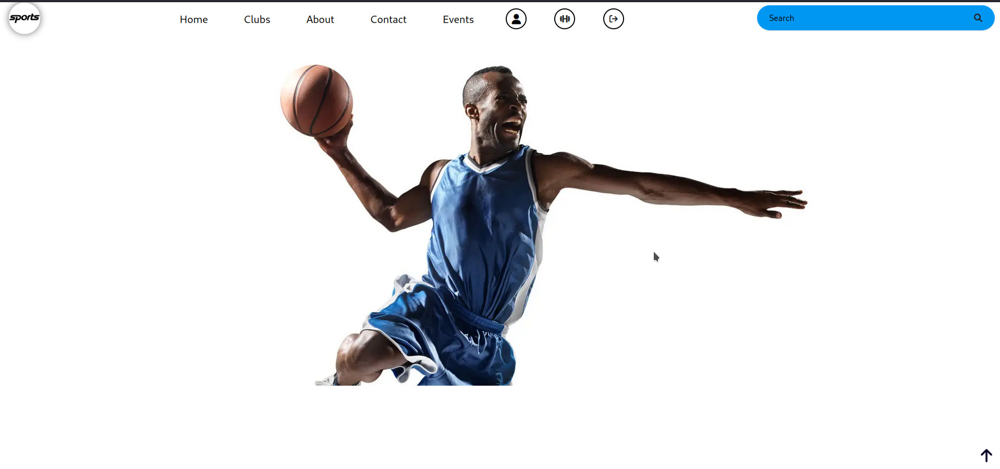
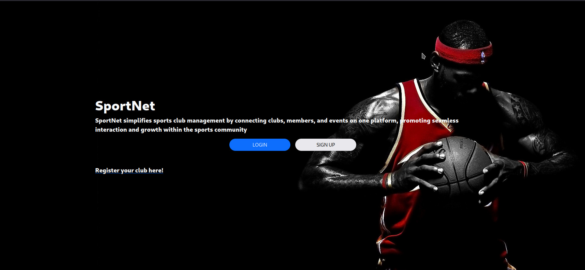
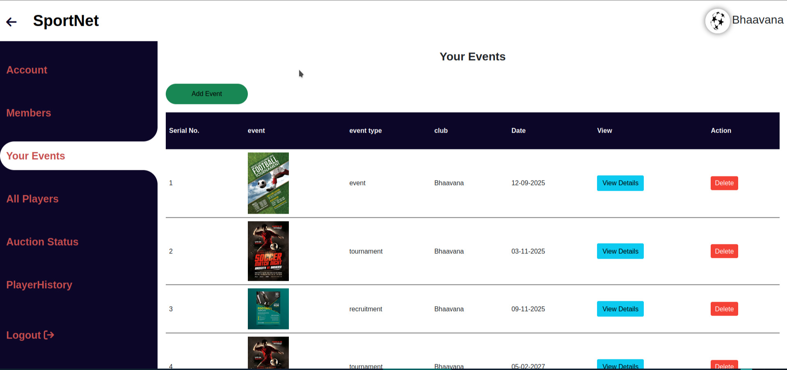
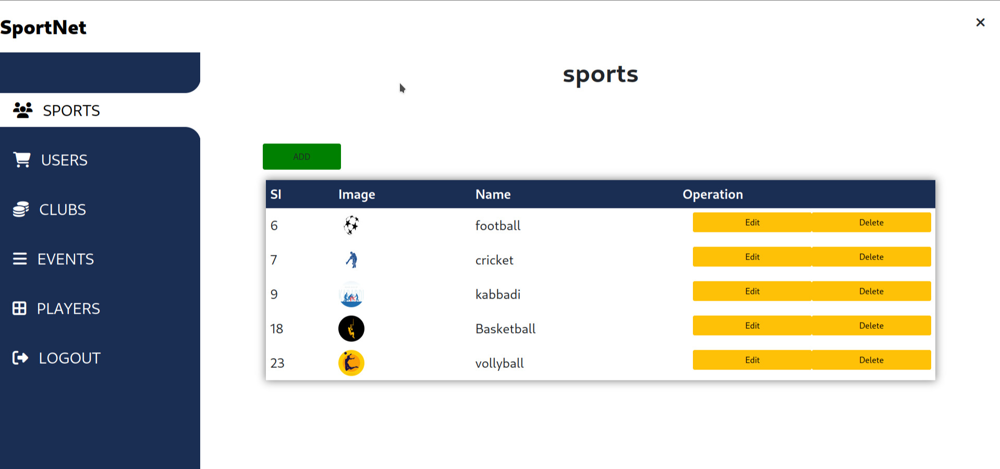

# 🏆 SportNet — Sports Club Management System

## 📋 Project Overview

The **SportNet Sports Club Management System** is a web-based platform designed to streamline the management of sports clubs, including member registration, event management, tournament coordination, and recruitment activities. It is built using PHP and MySQL with a responsive front-end using Bootstrap 5. This system helps reduce manual record-keeping and enhances accessibility, efficiency, and engagement among clubs and members.

---

## ⚙️ Technologies Used

- **Frontend**: HTML5, CSS3, Bootstrap 5, JavaScript
- **Backend**: PHP 7+
- **Database**: MySQL / MariaDB
- **Server**: Apache (via XAMPP)
- **IDE**: Visual Studio Code
- **Operating System**: Parrot OS (Linux)

---

## ✅ Features

- Club and Member Registration/Login
- Club Dashboard:
  - Manage members
  - Upload events and posters
  - Notify members automatically
- Member Dashboard:
  - View events
  - Participate in tournaments
  - Apply for recruitment
- Personal Assistant:
  - Select sports type, age, and health condition
  - Receive customized workout plans and diet suggestions
- Admin Panel:
  - Manage clubs
  - Monitor users
  - View statistics

---

## 📸 Demo

### 🏠 Home Page

### 💳 Index page

### 👤 Club Dashboard

### 👤 Admin Dashboard

## 📦 Installation

### Requirements:
- XAMPP (Apache + MySQL)
- Parrot OS (or any Linux/Windows/Mac)
- Browser (Chrome/Firefox)

### Steps:

1. Clone the repository or download the ZIP.
2. Place the project folder in the `htdocs` directory (`/opt/lampp/htdocs/` on Linux).
3. Start **Apache** and **MySQL** via XAMPP Control Panel.
4. Import the SQL file (`sportnet.sql`) into phpMyAdmin.
5. Visit `http://localhost/sportnet/` in your browser.

---

## 🗃️ Database Structure

Key Tables:
- `clubs`: Club information
- `clubuser`: Club members
- `users`: Users
- `events`: Tournament and recruitment posts
- `admin`: Admin login
- `workouts`: Personal assistant plans
- `diets`: Diet plans
- `notifications`: Auto alert system
- `auction`: Auction status

---

### 🔐 Admin Login

- **Username**: `admin@gmail.com`  
- **Password**: `admin@123`

---

## 📜 License

This project is developed as part of a BCA academic submission. Feel free to modify it for educational or personal use.
